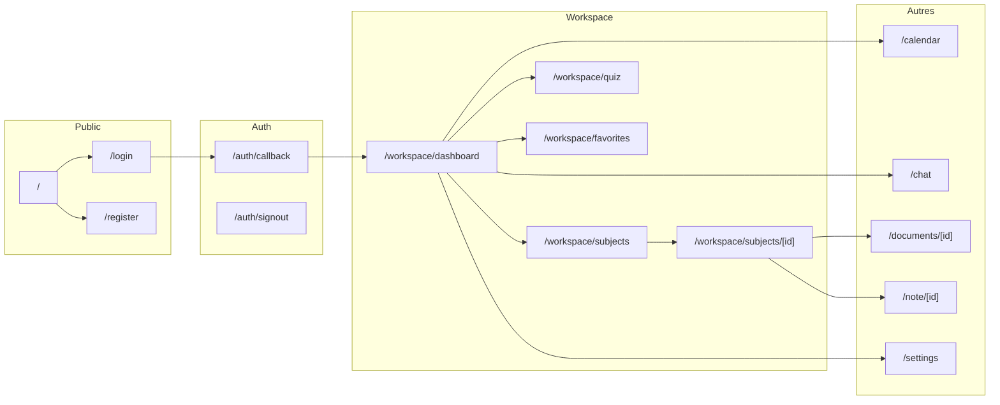

# Plan de chaque chemin – Nothly

Ce document recense tous les chemins de l'application : **pages (UI)** et **routes API**, avec leur rôle et les fichiers associés.

---

## 1. Pages publiques (sans auth obligatoire)

| Chemin         | Rôle                                                                              | Fichier                                              |
| -------------- | --------------------------------------------------------------------------------- | ---------------------------------------------------- |
| `/`            | Landing : présentation produit, CTA vers inscription/connexion                    | [app/page.tsx](app/page.tsx)                         |
| `/login`       | Connexion (mot de passe ou magic link), gestion erreurs OAuth                     | [app/login/page.tsx](app/login/page.tsx)             |
| `/register`    | Inscription par email/mot de passe                                                | [app/register/page.tsx](app/register/page.tsx)       |
| `/reset`       | Nettoyage session (signOut, localStorage, cookies) puis redirection vers `/login` | [app/reset/page.tsx](app/reset/page.tsx)             |
| `/pricing`     | Page tarification                                                                 | [app/pricing/page.tsx](app/pricing/page.tsx)         |
| `/test-toasts` | Page de test des toasts (dev)                                                     | [app/test-toasts/page.tsx](app/test-toasts/page.tsx) |

---

## 2. Auth (callbacks / signout)

| Chemin           | Méthode | Rôle                                                                                                                      | Fichier                                                  |
| ---------------- | ------- | ------------------------------------------------------------------------------------------------------------------------- | -------------------------------------------------------- |
| `/auth/callback` | GET     | Callback OAuth : échange du `code` contre une session Supabase, redirection vers `/workspace` ou `/login` en cas d'erreur | [app/auth/callback/route.ts](app/auth/callback/route.ts) |
| `/auth/signout`  | POST    | Déconnexion côté serveur (Supabase)                                                                                       | [app/auth/signout/route.ts](app/auth/signout/route.ts)   |

---

## 3. Redirections (pas de contenu propre)

| Chemin       | Redirection                                           | Fichier                                          |
| ------------ | ----------------------------------------------------- | ------------------------------------------------ |
| `/dashboard` | Utilisateur connecté → `/workspace`, sinon → `/login` | [app/dashboard/page.tsx](app/dashboard/page.tsx) |
| `/new`       | → `/workspace`                                        | [app/new/page.tsx](app/new/page.tsx)             |
| `/workspace` | → `/workspace/dashboard`                              | [app/workspace/page.tsx](app/workspace/page.tsx) |

---

## 4. Workspace (app principale, layout avec Sidebar)

Layout commun : [app/workspace/layout.tsx](app/workspace/layout.tsx) (Sidebar + WorkspaceContent).

| Chemin                     | Rôle                                                                           | Fichier                                                                      |
| -------------------------- | ------------------------------------------------------------------------------ | ---------------------------------------------------------------------------- |
| `/workspace/dashboard`     | Tableau de bord : résumé sujets, documents, collections d'étude, liens rapides | [app/workspace/dashboard/page.tsx](app/workspace/dashboard/page.tsx)         |
| `/workspace/subjects`      | Liste des sujets (matières)                                                    | [app/workspace/subjects/page.tsx](app/workspace/subjects/page.tsx)           |
| `/workspace/subjects/[id]` | Détail d'un sujet : documents, notes, quiz/fiches, onglets                     | [app/workspace/subjects/[id]/page.tsx](app/workspace/subjects/[id]/page.tsx) |
| `/workspace/quiz`          | Hub quiz : listage des collections quiz, lancement d'un quiz                   | [app/workspace/quiz/page.tsx](app/workspace/quiz/page.tsx)                   |
| `/workspace/favorites`     | Favoris                                                                        | [app/workspace/favorites/page.tsx](app/workspace/favorites/page.tsx)         |

---

## 5. Pages hors workspace (avec Sidebar ou layout dédié)

| Chemin                                 | Rôle                                                       | Fichier                                                                                              |
| -------------------------------------- | ---------------------------------------------------------- | ---------------------------------------------------------------------------------------------------- |
| `/calendar`                            | Calendrier (événements)                                    | [app/calendar/page.tsx](app/calendar/page.tsx)                                                       |
| `/chat`                                | Chat IA global (AIChat + Sidebar)                          | [app/chat/page.tsx](app/chat/page.tsx)                                                               |
| `/documents/[id]`                      | Détail d'un document (PDF, sections, résumés, quiz/fiches) | [app/documents/[id]/page.tsx](app/documents/[id]/page.tsx)                                           |
| `/documents/[id]/sections/[sectionId]` | Section d'un document                                      | [app/documents/[id]/sections/[sectionId]/page.tsx](app/documents/[id]/sections/[sectionId]/page.tsx) |
| `/note/[id]`                           | Éditeur de note (auto-save, temps réel, IA)                | [app/note/[id]/page.tsx](app/note/[id]/page.tsx)                                                     |

---

## 6. Paramètres (layout avec menu latéral)

Layout : [app/settings/layout.tsx](app/settings/layout.tsx) (Sidebar, menu Profil / Apparence / Plan / Sécurité / Notifications / Langue / Données / À propos).

| Chemin                    | Rôle                          | Fichier                                                                    |
| ------------------------- | ----------------------------- | -------------------------------------------------------------------------- |
| `/settings`               | Page d'accueil des paramètres | [app/settings/page.tsx](app/settings/page.tsx)                             |
| `/settings/profile`       | Profil utilisateur            | [app/settings/profile/page.tsx](app/settings/profile/page.tsx)             |
| `/settings/appearance`    | Thème / apparence             | [app/settings/appearance/page.tsx](app/settings/appearance/page.tsx)       |
| `/settings/plan`          | Abonnement / plan             | [app/settings/plan/page.tsx](app/settings/plan/page.tsx)                   |
| `/settings/security`      | Sécurité (mot de passe, etc.) | [app/settings/security/page.tsx](app/settings/security/page.tsx)           |
| `/settings/notifications` | Préférences de notifications  | [app/settings/notifications/page.tsx](app/settings/notifications/page.tsx) |
| `/settings/language`      | Langue                        | [app/settings/language/page.tsx](app/settings/language/page.tsx)           |
| `/settings/data`          | Données / export              | [app/settings/data/page.tsx](app/settings/data/page.tsx)                   |
| `/settings/about`         | À propos                      | [app/settings/about/page.tsx](app/settings/about/page.tsx)                 |

---

## 7. Dashboard "legacy" / pricing

| Chemin               | Rôle                                            | Fichier                                                          |
| -------------------- | ----------------------------------------------- | ---------------------------------------------------------------- |
| `/dashboard/pricing` | Tarification (sous-route de l'ancien dashboard) | [app/dashboard/pricing/page.tsx](app/dashboard/pricing/page.tsx) |

---

## 8. Erreurs et 404

| Fichier                                                | Rôle                            |
| ------------------------------------------------------ | ------------------------------- |
| [app/error.tsx](app/error.tsx)                         | Erreur runtime (boundary)       |
| [app/global-error.tsx](app/global-error.tsx)           | Erreur globale                  |
| [app/not-found.tsx](app/not-found.tsx)                 | 404                             |
| [app/workspace/error.tsx](app/workspace/error.tsx)     | Erreur dans le workspace        |
| [app/workspace/loading.tsx](app/workspace/loading.tsx) | État de chargement du workspace |

---

## 9. Routes API – regroupement par domaine

### Auth / dev

- `GET/POST/DELETE /api/dev-login` – Connexion dev (bypass).
- `GET /api/dev-upgrade` – Upgrade dev (simulation plan).

### Sujets (subjects)

- `GET /api/subjects` – Liste des sujets de l'utilisateur.
- `POST /api/subjects` – Créer un sujet.
- `GET /api/subjects/[id]` – Détail d'un sujet.
- `PATCH /api/subjects/[id]` – Modifier un sujet.
- `DELETE /api/subjects/[id]` – Supprimer un sujet.
- `GET /api/subjects/[id]/documents` – Documents d'un sujet.
- `GET /api/subjects/[id]/study` – Données "study" d'un sujet.

### Documents

- `GET /api/documents` – Liste des documents.
- `POST /api/documents` – Créer / uploader un document.
- `GET /api/documents/[id]` – Détail d'un document.
- `DELETE /api/documents/[id]` – Supprimer un document.
- `GET /api/documents/[id]/status` – Statut de traitement du document.
- `GET /api/documents/[id]/pdf` – PDF (stream ou URL).
- `GET /api/documents/summaries` – Résumés (liste).
- `POST /api/documents/heatmap` – Heatmap (données).

### Notes

- `GET /api/notes` – Liste des notes.
- `POST /api/notes` – Créer une note.
- `GET /api/notes/[id]` – Détail d'une note.
- `PATCH /api/notes/[id]` – Mettre à jour une note.
- `DELETE /api/notes/[id]` – Supprimer une note.
- `POST /api/notes/[id]/beacon` – Beacon (auto-save / heartbeat).
- `GET /api/notes/recent` – Notes récentes.

### Chat / IA

- `POST /api/chat` – Chat global.
- `POST /api/chat/subject` – Chat lié à un sujet.
- `POST /api/ai` – Appel IA générique.
- `POST /api/ai/improve` – Amélioration de texte (IA).

### Quiz / flashcards / study

- `GET /api/study-subjects` – Liste des "study subjects" (collections).
- `GET /api/study-subjects/[id]` – Détail d'une collection.
- `DELETE /api/study-subjects/[id]` – Supprimer une collection.
- `GET /api/study-collections/check-title` – Vérifier unicité du titre.
- `POST/GET /api/quiz/generate-targeted` – Génération de quiz ciblé.
- `POST/GET /api/quiz/progress` – Progression quiz.
- `POST/GET /api/flashcards/progress` – Progression flashcards.

### Calendrier

- `GET /api/calendar/events` – Liste des événements.
- `POST /api/calendar/events` – Créer un événement.
- `DELETE /api/calendar/events/[id]` – Supprimer un événement.
- `POST /api/calendar/generate-plan` – Génération de plan (IA).

### Billing (Stripe)

- `POST /api/stripe/checkout` – Créer une session checkout Stripe.
- `POST /api/stripe/webhook` – Webhook Stripe (paiements, abonnements).

### Jobs / recherche / monitoring

- `GET /api/jobs/[id]` – Statut d'un job.
- `GET /api/search` – Recherche globale.
- `GET /api/monitor` – Endpoint de monitoring (santé / métriques).

---

## 10. Schéma des flux principaux

---

En résumé : **pages** = 29 routes UI (dont redirections et erreurs), **API** = une quarantaine d'endpoints regroupés en auth, subjects, documents, notes, chat/IA, quiz/flashcards, calendar, Stripe, jobs, search, monitor. Ce document peut servir de base pour la doc technique, l'onboarding ou un refactoring ciblé.
